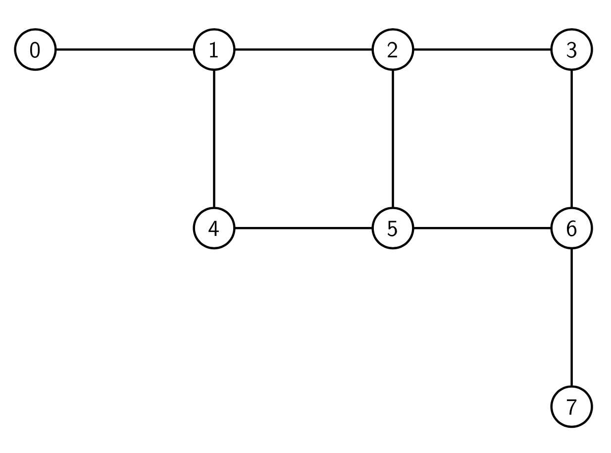

# Graph Mapping

To start this exercise, we'll look at a complete Ocean program that uses the
package ``dwave-networkx``.  D-Wave NetworkX is an extension of NetworkX—a
Python language package for exploration and analysis of networks and network
algorithms—for users of D-Wave Systems.  The base problem of this exercise is
the antenna selection problem from the [D-Wave Collection of
Examples](https://github.com/dwave-examples/antenna-selection).

## Exercise 1

Enter your token on line 30 of ``original_program.py`` and run the program.
Read through the code and take a look at the structure of the program.  In
particular, pay attention to:

- How are we creating the graph structure?
- How are we defining and calling our sampler?

## Exercise 2

Open ``change_sampler.py``.  This file is identical to ``original_program.py``,
but does not have a sampler defined.  Set up your sampler in the
``set_sampler`` function to run the simulated annealing algorithm.

Note:  Don't forget to import the package where the sampler lives.  You may
find the [Ocean documentation](https://docs.ocean.dwavesys.com/en/stable/)
useful.

## Exercise 3

Open ``change_problem.py``.  This file is identical to ``original_program.py``,
but is missing the following things:  (1) a graph definition, and (2) a graph
algorithm from ``dwave-networkx``.  Fill in the functions ``create_graph`` and
``solve_problem`` in this program to solve the minimum vertex cover on the
following graph.  You will also need to input your token at the start of the
program.

## License

Released under the Apache License 2.0. See [LICENSE](LICENSE) file.
